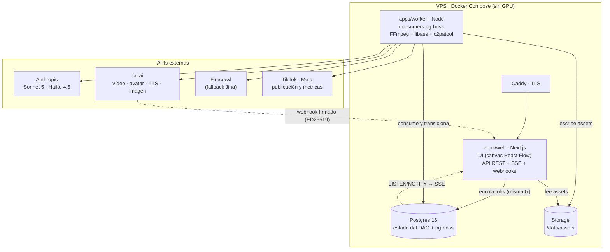
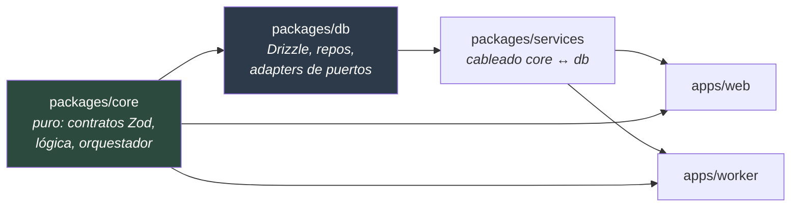
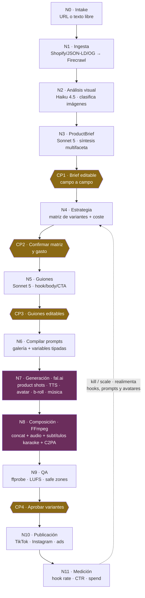

# UGC Factory

> De la URL de un producto a una matriz de anuncios UGC en vertical (9:16) para TikTok e Instagram Reels: análisis con IA, guiones, generación de vídeo, composición con subtítulos karaoke, publicación y métricas — todo orquestado como un pipeline visual con checkpoints donde tú decides.

**Herramienta personal, mono-usuario y self-hosted.** No es un SaaS: no tiene billing, ni multi-tenancy, ni onboarding. Es la máquina de anuncios de un único operador técnico, y ese recorte es deliberado — permite invertir toda la complejidad en lo que de verdad importa.

> [!IMPORTANT]
> **Estado: en construcción (51 de 103 tareas, ~50 %).** Hoy el sistema **analiza productos, planifica lotes de anuncios y escribe sus guiones (aprobables en CP3), pero todavía no fabrica ni un solo vídeo.** La generación de media (fal.ai) y la composición (FFmpeg) aún no están construidas. Detalle honesto en [Estado del proyecto](#estado-del-proyecto).

---

## Índice

- [Por qué existe](#por-qué-existe)
- [Qué hace (y qué no)](#qué-hace-y-qué-no)
- [Arquitectura](#arquitectura)
- [El pipeline](#el-pipeline)
- [Estado del proyecto](#estado-del-proyecto)
- [Puesta en marcha](#puesta-en-marcha)
- [Los paquetes del monorepo](#los-paquetes-del-monorepo)
- [Desarrollo, tests y gate](#desarrollo-tests-y-gate)
- [Documentación](#documentación)
- [Licencia](#licencia)

---

## Por qué existe

El mercado de generación de UGC con IA está lleno (Arcads, MakeUGC, HeyGen, Tagshop…), y aun así **nadie une las piezas que importan**. Todas las plataformas hacen lo mismo: avatar + voz + render. Lo que ninguna hace es conectar el análisis estratégico del producto con la matriz de variantes y con la medición que realimenta el sistema.

Las cuatro tesis sobre las que se construye esto:

1. **La integración es el producto.** Generar "un vídeo con un avatar" ya es _commodity_: TikTok lo regala dentro de su propio Ads Manager. El valor no está ahí. Está en el recorrido completo: URL → análisis multifaceta (beneficios, audiencia con niveles de consciencia, objeciones **con su contraargumento**) → matriz de variantes → publicación → métricas que deciden el siguiente lote.

2. **Una sola API cubre toda la generación de media.** [fal.ai](https://fal.ai) da vídeo con audio nativo, avatares, lipsync, TTS multilingüe e imagen con referencias bajo una única clave _pay-per-use_. La única pieza que queda fuera es el burn-in de subtítulos estilo TikTok, que exige un worker FFmpeg propio.

3. **El pipeline es la interfaz.** No hay un formulario que escupe un vídeo. Hay un grafo de nodos con estado en vivo, **checkpoints editables** donde el pipeline se pausa (el brief, la matriz, los guiones, el QA) y un modo autopilot que los salta. Es control de gasto, control de calidad y observabilidad en el mismo gesto.

4. **Compliance de primera clase, no un parche.** Disclosure de contenido generado por IA (TikTok, Meta), firma [C2PA](https://c2pa.org/) en cada export (el EU AI Act lo exige desde el 2 de agosto de 2026) y _guardrails_ que reformulan el ángulo "testimonial" como demo de creador, porque la FTC prohíbe los testimonios sintéticos que simulan clientes reales.

Cada afirmación de mercado del [PRD](PRD.md) está respaldada por los informes de [`research/`](research/).

---

## Qué hace (y qué no)

**El recorrido completo, cuando esté terminado:** pegas la URL de un producto (o escribes un párrafo describiéndolo si aún no tiene web). El sistema lo scrapea, analiza sus imágenes, y sintetiza un **ProductBrief** editable: beneficios, segmentos de audiencia, dolores, objeciones con su contraargumento, prueba social, precio, y 5–10 ángulos publicitarios. Tú lo revisas y lo apruebas. Eliges ángulos y el sistema compone una **matriz de variantes** (ángulos × hooks × avatares × duraciones × idiomas) con su coste estimado antes de gastar un céntimo. Aprueba, y escribe los guiones, compila los prompts, genera los assets en fal.ai, los compone con FFmpeg (voz + b-roll + música con ducking + subtítulos karaoke palabra a palabra), los firma con C2PA, los publica en TikTok/Instagram y lee sus métricas a las 24–48 h para decirte cuáles matar y cuáles escalar.

**Fuera de alcance, explícitamente:** multi-tenancy y billing · clonar tu cara y tu voz (los avatares son 100 % sintéticos) · un editor de timeline al uso (se itera regenerando nodos, no moviendo keyframes) · scraping de Amazon · modelos self-hosted con GPU (toda la IA va por API; el VPS solo pone CPU para FFmpeg).

---

## Arquitectura

Un monorepo TypeScript de punta a punta. Dos procesos (la web y el worker) que se comunican **exclusivamente a través de Postgres**: el estado del pipeline vive en tablas, no dentro de un motor de colas opaco, porque es un ciudadano de primera clase — se pausa, se edita, se visualiza y se audita.



**Las decisiones que explican el resto:**

| Capa                | Elección                                                                        | Por qué                                                                                                                    |
| ------------------- | ------------------------------------------------------------------------------- | -------------------------------------------------------------------------------------------------------------------------- |
| Estado del pipeline | Tablas propias (`pipeline_run` / `step_run`) + máquina de estados transaccional | El pipeline necesita pausas _human-in-the-loop_ y visualización en vivo. El estado no puede estar dentro de un motor opaco |
| Colas               | **pg-boss** (jobs sobre Postgres)                                               | Sin Redis: una pieza menos que operar. pg-boss solo despacha ejecución (retries, backoff); el estado es nuestro            |
| Realtime            | **SSE** alimentado por `LISTEN/NOTIFY`                                          | Server→cliente basta para el canvas. Más simple que WebSockets                                                             |
| Base de datos       | **Postgres 16 + Drizzle**                                                       | JSONB para el brief y las facetas; SQL explícito, sin engine binario                                                       |
| Canvas              | **React Flow**                                                                  | El grafo de nodos es una vista 1:1 de las tablas                                                                           |
| LLM                 | **Anthropic directo** (Sonnet 5 síntesis, Haiku 4.5 visión)                     | El análisis es <5 % del COGS: no se degrada el modelo de la pieza más inteligente                                          |
| Media               | **fal.ai** tras una capa `ModelProfile` (config en BD, no hardcode)             | El catálogo rota cada 4–8 semanas: cambiar de modelo no debe tocar código                                                  |
| Composición         | **FFmpeg + libass + c2patool** propios                                          | Única vía para subtítulos ASS karaoke, ducking, `loudnorm` −14 LUFS y firma C2PA, a coste marginal de CPU                  |

Y el grafo de dependencias entre paquetes, que es la regla que gobierna dónde vive cada cosa:



`core` no sabe nada de la base de datos: define **puertos** (interfaces) y `db` los implementa. `web` y `worker` son _composition roots_ hermanos: ninguno importa del otro, y por eso existe `services` — para compartir lo que ambos necesitan sin duplicarlo.

---

## El pipeline

Cada lote instancia un **DAG de nodos tipados**. Cada nodo es un `step_run` con su propio estado, coste estimado y real, inputs/outputs, y —si es checkpoint— una pausa esperando tu aprobación.



Los nodos en **amarillo** son los checkpoints: el pipeline se congela y espera. Los **morados** son los que aún no están construidos.

**Tres reglas que hacen que esto funcione de verdad:**

- **Editar invalida hacia abajo, nunca hacia arriba.** Si cambias el brief en CP1, el sub-grafo aguas abajo se invalida y se re-ejecuta. Y la invalidación **nunca resetea filas**: crea un `step_run` nuevo que apunta al anterior (`supersedes_id`), de modo que el histórico y el linaje de costes se conservan enteros.
- **Todo artefacto intermedio se persiste** (el brief, cada guion, cada prompt resuelto, cada asset). Eso es lo que permite reanudar, regenerar solo una parte y auditar qué produjo qué.
- **Los executors son idempotentes.** pg-boss re-entrega jobs tras un reinicio; el executor, al reentrar, consulta si ya hay una petición en vuelo contra fal.ai y **reanuda el seguimiento en vez de re-enviarla** — porque re-enviarla cuesta dinero real.

La economía también es una decisión de diseño: en un lote de _hook-testing_, el body y el CTA se comparten entre variantes y solo se abre el abanico en los hooks. Con 3 hooks × 2 bodies × 2 CTAs, **7 clips generados dan 12 anuncios** en vez de pagar 12 vídeos completos.

---

## Estado del proyecto

El desarrollo va por fases, tarea a tarea, con verificación observable en cada una. [`planning.md`](planning.md) es la fuente de verdad, y esta tabla se genera desde él (`pnpm readme:status`): no puede desfasarse sin que el gate lo cace.

<!-- STATUS-TABLE:BEGIN — generado por `pnpm readme:status`, no editar a mano -->

**54 de 103 tareas cerradas (52 %).**

| Fase                                                  | Qué entrega                                                                         | Estado         |
| ----------------------------------------------------- | ----------------------------------------------------------------------------------- | -------------- |
| **F0** · Fundaciones                                  | Orquestador DAG, auth, storage, colas, SSE, canvas, ledger de gasto                 | ✅ Completa    |
| **FD** · Design system                                | Design system: ~26 primitivas, dark/light, 4 acentos                                | ✅ Completa    |
| **F1** · Análisis                                     | URL/texto → ProductBrief editable y aprobable en CP1                                | ✅ Completa    |
| **F1b** · Deuda de cierre de F1                       | Deuda de cierre de F1                                                               | ✅ Completa    |
| **F1c** · Deuda del primer uso real                   | Deuda del primer uso real                                                           | ✅ Completa    |
| **F2** · Estrategia y guiones                         | Matriz con coste estimado → guiones aprobados                                       | ✅ Completa    |
| **F2b** · Deuda destapada por la verificación de T2.3 | Deuda destapada por la verificación de T2.3 (acordada con el usuario el 2026-07-14) | ✅ Completa    |
| **F3** · Galería de prompts y compilador              | Templates facetados → prompts auditables                                            | 🔨 3/8         |
| **F4** · Generación fal.ai                            | Los assets de una variante, generados de verdad en fal.ai                           | ⬜ No empezada |
| **F5** · Composición, QA y export                     | El anuncio 9:16 completo, con subtítulos, C2PA y QA                                 | ⬜ No empezada |
| **F6** · Publicación                                  | Publicar en TikTok/IG y crear el ad draft                                           | ⬜ No empezada |
| **F7** · Medición y flywheel                          | Métricas por variante + kill/scale + scoring                                        | ⬜ No empezada |
| **F8** · Operación y extensiones                      | Backups, retención, observabilidad, MCP                                             | ⬜ No empezada |

<!-- STATUS-TABLE:END -->

**Lo que funciona hoy**, de verdad y verificado: el monorepo con Postgres y Drizzle · auth mono-usuario · storage con descarga proxificada · colas pg-boss · **el orquestador transaccional del DAG** (checkpoints, retries, timeouts, cancelación, invalidación con linaje) · SSE en vivo · el canvas de React Flow · el ledger de gasto con credenciales cifradas · el design system completo · **el pipeline de análisis real N1→N2→N3** (Firecrawl/Jina + Haiku 4.5 + Sonnet 5) que produce un ProductBrief editable y aprobable · el listado de runs · la librería de personas · el compositor de la matriz de lote con su estimador de coste y su confirmación de gasto en CP2 · y **la escritura de guiones (N5, Sonnet 5) con sus guardrails FTC, editables y aprobables por variante en CP3** — el lote pasa a `scripted` cuando apruebas.

**Lo que no existe todavía:** la galería y el compilador de prompts (N6) · **cualquier generación de vídeo o audio con fal.ai (N7)** · la composición con FFmpeg (N8) · el export, la publicación y las métricas.

> [!NOTE]
> **Producción está en marcha** en [ugc.carlosvillu.dev](https://ugc.carlosvillu.dev) (desplegada en un VPS con Caddy; T0.13). El desarrollo local sigue siendo `pnpm dev` + Docker Compose. El despliegue es manual por ahora (CI y branch protection son una tarea pendiente).

**Otras deudas conocidas** (documentadas, no escondidas): `pipeline_run.status` no lo mantiene nadie todavía —se deriva de los steps—; el KPI de "coste estimado" pinta $0,00 porque aún nadie escribe esa columna; y el rate-limit del login confía en `x-forwarded-for` sin trust boundary hasta que exista el proxy de Caddy.

---

## Puesta en marcha

**Requisitos:** Node (ver [`.nvmrc`](.nvmrc)), [pnpm](https://pnpm.io) 10, Docker (para Postgres).

```bash
# 1. Dependencias
pnpm install

# 2. Configuración: copia el ejemplo y ajústalo
cp .env.example .env
#    Genera una APP_MASTER_KEY real (cifra las cookies de sesión y los secretos):
#      openssl rand -hex 32
#    Y pon una AUTH_BOOTSTRAP_PASSWORD: es la contraseña con la que entrarás.

# 3. Postgres
docker compose -f docker-compose.dev.yml up -d

# 4. Migraciones y datos semilla (hooks, CTAs, recetas, personas)
pnpm db:migrate
pnpm seed

# 5. Arranca la web y el worker
pnpm dev
```

La aplicación queda en `http://localhost:3000`. Entra con la contraseña que pusiste en `AUTH_BOOTSTRAP_PASSWORD` — se hashea y se siembra en el primer arranque.

**Para analizar un producto de verdad** necesitas dos claves, que se configuran **desde la propia UI** (`/settings`, se guardan cifradas en la base de datos, nunca en el `.env`): una de [Anthropic](https://console.anthropic.com) y otra de [Firecrawl](https://firecrawl.dev). Sin ellas puedes recorrer el sistema con los DAGs de demo, pero no ejecutar un análisis real.

> El `.env` está en `.gitignore` y **nunca debe committearse**. El repositorio no contiene ninguna credencial real: los valores de `.env.test` son literales de test explícitamente falsos.

---

## Los paquetes del monorepo

Cada uno tiene su propio README con sus comandos y su contrato.

| Paquete                                      | Qué es                                                                                                                                   |
| -------------------------------------------- | ---------------------------------------------------------------------------------------------------------------------------------------- |
| [`packages/core`](packages/core)             | El núcleo **puro**: contratos Zod, lógica determinista, clientes de IA y la máquina de estados del orquestador. No toca la base de datos |
| [`packages/db`](packages/db)                 | Persistencia: schema Drizzle (15 tablas), migraciones, repos y los **adapters** que implementan los puertos de `core`                    |
| [`packages/services`](packages/services)     | El cableado entre `core` y `db`: los servicios del pipeline de análisis que **web y worker comparten**                                   |
| [`apps/web`](apps/web)                       | Next.js: la UI (canvas, checkpoints, editor de brief) **y** toda la API REST + SSE                                                       |
| [`apps/worker`](apps/worker)                 | El daemon que consume la cola y ejecuta los steps del pipeline                                                                           |
| [`packages/test-utils`](packages/test-utils) | Arnés de test interno (Testcontainers, msw, fixtures). Solo `devDependency`                                                              |

---

## Desarrollo, tests y gate

```bash
pnpm dev              # web + worker en paralelo
pnpm test             # unit + integration (hermético: sin red, sin dinero)
pnpm test:e2e         # Playwright (providers fake, determinista y gratis)
pnpm gate             # lint + typecheck + format:check + knip + test
```

`pnpm gate` es **el** gate: ninguna tarea se cierra sin pasarlo entero. Los tests estándar son herméticos por construcción — no tocan red real ni gastan dinero. Los que sí lo hacen viven aparte y detrás de un techo de gasto explícito:

```bash
pnpm test:live        # contra APIs reales — CUESTA DINERO (guard: LIVE_BUDGET_USD)
pnpm test:media       # tests de FFmpeg
```

El proyecto se desarrolla mediante un **bucle autónomo de agentes** gobernado por las skills de [`.claude/`](.claude/skills/): cada tarea del planning la implementa un agente con contexto fresco, y un verificador escéptico e independiente ejecuta la verificación literal contra el sistema real antes de dejarla cerrar. La evidencia de cada tarea queda en [`docs/verifications/`](docs/verifications/) y la bitácora en [`docs/dev-loop/journal.md`](docs/dev-loop/journal.md). Nadie se autoevalúa, y ninguna tarea se marca como hecha sin evidencia.

---

## Documentación

| Documento                                    | Qué es                                                                                           |
| -------------------------------------------- | ------------------------------------------------------------------------------------------------ |
| [`PRD.md`](PRD.md)                           | El producto completo: arquitectura, pipeline, modelo de datos, integraciones, compliance, costes |
| [`planning.md`](planning.md)                 | La fuente de verdad del **estado**: fases → tareas con dependencias y verificación observable    |
| [`research/`](research/)                     | Los informes que respaldan cada afirmación del PRD (mercado, fal.ai, FFmpeg, plataformas)        |
| [`docs/design-system/`](docs/design-system/) | Espejo de solo lectura del design system                                                         |
| [`docs/verifications/`](docs/verifications/) | La evidencia de cierre de cada tarea                                                             |

---

## Licencia

[GNU Affero General Public License v3.0](LICENSE) — Copyright (C) 2026 Carlos Villuendas Zambrana.

La AGPL es deliberada: si despliegas este software como servicio en red, **debes publicar tu código**, incluidas tus modificaciones. Se comparte para que se aprenda de él y se mejore, no para que alguien lo cierre y lo revenda.
